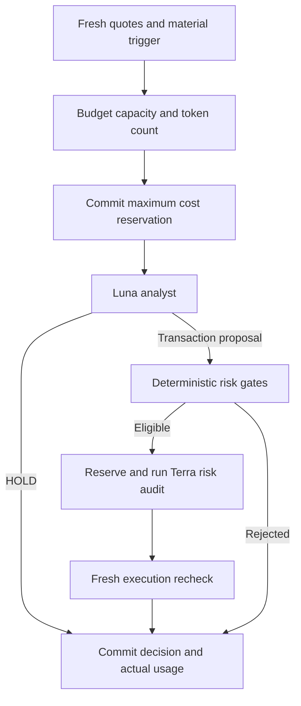

# Budgeted Quant decisions — 7 October 2026

The owner requested a maximum **USD 5 per UTC calendar month**. The limit applies to this existing Quant workflow, with a USD 0.16 daily limit and at most 16 generation attempts per UTC day. All callers go through `model-client.js`; there is no second schedule or unmetered fallback.

## Decision process

- Existing deterministic universe selection and quote monitoring remain on the 15-minute workflow. No generation is needed for these tasks.
- Existing quote age, new invalidation, material price movement and duplicate gates apply. Unchanged position reviews wait 120 minutes; watchlist-only reviews wait 240 minutes.
- GPT-6 Luna, low reasoning, makes one consolidated Quant/PM decision. HOLD uses one generation. Expired/stale macro context is excluded from current directional reasoning; absent news is explicitly unknown.
- A proposed transaction must pass the existing hard risk checks before a GPT-5.6 Terra, low-reasoning audit. FAIL is binding. A budget or API failure is a blocked attempt, not a fabricated HOLD or a committed trade.
- Execution prices and FX are refetched after analysis, hard gates rerun, and movement over 0.5% invalidates execution. Paper ledger validation, concurrency protection, idempotency and exact read-back remain mandatory.
- Prompt payloads contain compact relevant positions, setup rules and metrics. Past report archives and the entire ledger are never included. Max rendered input: 6,000 tokens; max output including reasoning: 1,600 analyst / 1,200 audit. Oversized input fails closed rather than dropping risk information.

## Accounting that survives interruptions

`data.js/automationHealth.apiBudget` stores monthly/daily totals, unknown charges and pending reservations in integer USD microdollars. Before generation:

1. Confirm budget capacity, allowed model and payload byte ceiling.
2. Count rendered input with `POST /v1/responses/input_tokens`; unavailable or invalid counts block generation.
3. Reserve the maximum charge using the larger input/cache-write rate plus maximum output, with 10% headroom.
4. Commit the reservation to authoritative `main` and verify its contents by read-back. A conflict, failed push or read-back prevents generation.
5. Generate once with a fixed output cap and Standard processing. No built-in paid tools or automatic model fallback.
6. Reconcile returned input/output/cache-read/cache-write usage. The next reservation also persists prior settlement; final state commits on success or failure.

A crash or timeout leaves the full reserved bound in the allowance. Explicit rejected requests release their cost reservation but count toward the daily attempt cap. Unknown response usage retains the maximum charge. An unexpected usage overrun disables further spending pending reconciliation. Month/day rollover does not release older reservations. These are conservative accounting bounds at the documented rates, not an account-wide OpenAI billing control: another application sharing the key/account is outside this workflow's limit.

Pricing verified 7 October 2026, USD per million tokens:

| Model | Input | Cached input | Cache write | Output |
|---|---:|---:|---:|---:|
| GPT-6 Luna | 0.10 | 0.01 | 0.125 | 0.50 |
| GPT-5.6 Terra | 2.00 | 0.20 | 2.50 | 12.00 |

Sources: [Luna](https://developers.openai.com/api/docs/models/gpt-6-luna), [Terra](https://developers.openai.com/api/docs/models/gpt-5.6-terra), [token counting](https://developers.openai.com/api/docs/guides/token-counting), [caching](https://developers.openai.com/api/docs/guides/prompt-caching). Pricing changes require updating the allowlisted rate card. No cache discount is assumed in reservations. Short, event-specific prompts use explicit mode without breakpoints, avoiding cache-write charges for context unlikely to be reused within 30 minutes. No padding or paid cache warmup is used.

Example estimate (not a quality/performance guarantee): 8 analyst calls/day with 3,000 input and 500 output tokens cost about $0.14 per 31-day month. Two daily audits at 4,000 input and 500 output cost about $0.87/month. Usage depends on actual reasoning output and signals; the hard allowance, rather than this estimate, controls spending.

## October baseline and recovery

The owner's 7 October screenshot reports $5.04 October-to-date account spend. As precise historical Quant-only dollar attribution is unavailable, the full amount is conservatively booked as October opening expense. It is not falsely labelled measured token usage or 6 October daily spend. October has no remaining allowance. November starts a fresh USD 5 allowance; unused budget does not roll over. Replenishing API credits or manual `retry_openai` cannot bypass the budget.

The provider quota block is independent of this spending limit. After the month resets, actual API credit and model access must still be available. The first paid Luna request is deliberately not tested against the already exhausted October allowance. Tests use simulated provider responses. An API/model error fails closed with an hourly retry cooldown; credit exhaustion uses the existing six-hour cooldown.

`migrate-budget.js` is an idempotent deployment migration. It preserves cash, quantities, valuations and historical trades. Existing full reports stay archived; their old four-role PASS/HOLD labels are not current model status.

## Dashboard interpretation

The overview is intentionally small. Model/budget status takes precedence over old successful report labels. Price timestamps and monitoring timestamps are distinct. Gross paper P/L remains untouched. Estimated P/L after known API costs uses recorded EUR/USD and explicitly excludes unrecorded earlier costs; operational costs are not deducted from simulated trading cash. Open positions retain their entry thesis and invalidation, while new watchlist setups are shown separately.
